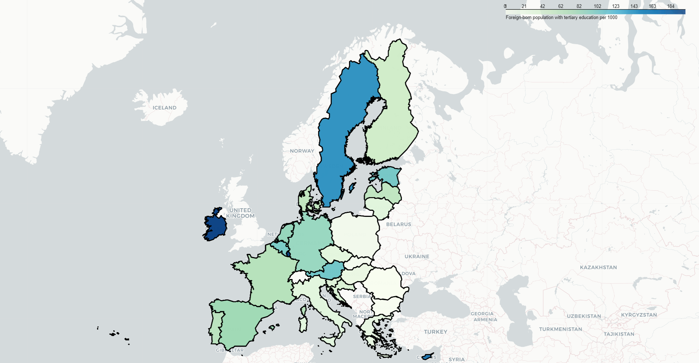

# Conditions associated with immigration of skilled people

This project explores the social and economical conditions associated with the amount of immigration of skilled people (as visualised in the map below) through visualisation, case-by-case comparison and clustering.

